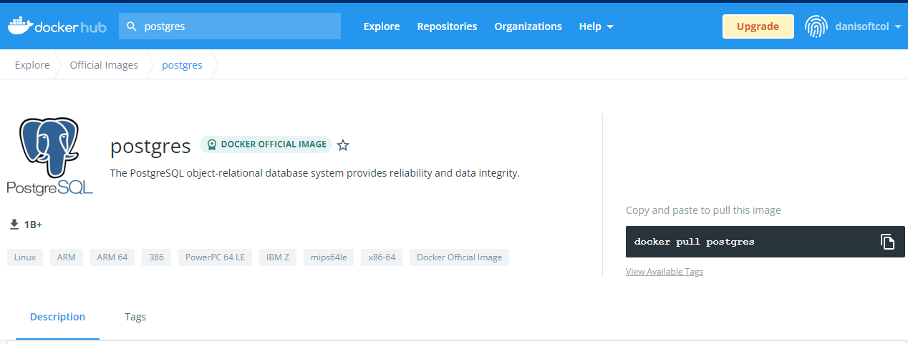
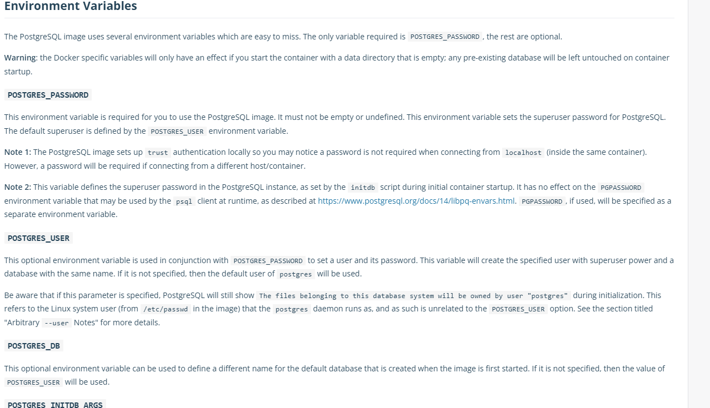

# Prácticas Docker

## 10. Variables

- Vamos a realizar un ejemplo de variables con la imagen de postgres:



- Podemos comprobar dentro de la documentación de Docker hub que la
  imagen de Postgres dispone de una serie de variables para poder
  construir nuestra base de datos:
  

- Por tanto vamos a crear un contenedor postres con los siguientes datos:

  - base de datos: pt1
  - Usuario de base de datos: usudb1
  - Password: danisoft

- Primero, nos descargamos la imagen:

```
docker pull postgres

Using default tag: latest
latest: Pulling from library/postgres
c229119241af: Already exists
3ff4ca332580: Pull complete
5037f3c12de6: Pull complete
0444ef779945: Pull complete
47098a4166e7: Pull complete
203cca980fab: Pull complete
a479b6c0e001: Pull complete
1eaa9abe8ca4: Pull complete
cad613328fe3: Pull complete
1ce5087aacfa: Pull complete
b133d2355caa: Pull complete
b2694eb85faf: Pull complete
503b75e1e236: Pull complete
Digest:
sha256:e3d8179786b8f16d066b313f381484a92efb175d1ce8355dc18
0fee1d5fa70ec
Status: Downloaded newer image for postgres:latest
docker.io/library/postgres:latest
```

- Comprobamos que la tenemos:

```
docker images | grep postgres

postgres latest 1ee973e26c65 13 days ago 376MB
```

- Creamos un contenedor con los datos indicados previamente:

```
docker run -d --name postgres1 -e POSTGRES_USER=usudb1 -e POSTGRES_DB=pt1 -e POSTGRES_PASSWORD=danisoft postgres

f50741945fe034e5ee243cafa2a1ac16831c128ee784cb5e48db4c3e8fe3be9b

```

- Comprobamos que está funcionando:

```
docker ps

CONTAINER ID IMAGE COMMAND CREATED
STATUS PORTS NAMES
f50741945fe0 postgres "docker-entrypoint.s…" About a
minute ago Up About a minute 5432/tcp postgres1

```

- Vamos ahora a entrar dentro del contenedor para comprobar que todo
  está correcto:

```
docker exec -it postgres1 bash

root@f50741945fe0:/#
```

- Invocamos al comando en modo línea para conectarnos a postgres que se denomina PSQL. Le indicamos además el usuario y la base de datos con la que queremos conectarnos, y de esa manera comprobamos que efectivamente se ha creado de forma correcta todo lo que hemos indicado anteriormente:

```
psql -U usudb1 pt1

psql (14.2 (Debian 14.2-1.pgdg110+1))
Type "help" for help.

pt1=#
```

- Una vez dentro comprobamos por ejemplo que existen las bases de
  datos. Para hacerlo lanzamos el comando \l:

```
pt1=# \l
 List of databases
 Name | Owner | Encoding | Collate | Ctype | Access privileges
-----------+--------+----------+------------+------------+-------------------
postgres | usudb1 | UTF8 | en_US.utf8 | en_US.utf8 |
pt1 | usudb1 | UTF8 | en_US.utf8 | en_US.utf8 |
template0 | usudb1 | UTF8 | en_US.utf8 | en_US.utf8 | =c/usudb1 +
 | | | | | usudb1=CTc/usudb1
template1 | usudb1 | UTF8 | en_US.utf8 | en_US.utf8 | =c/usudb1 +
 | | | | | usudb1=CTc/usudb1
(4 rows)
```
