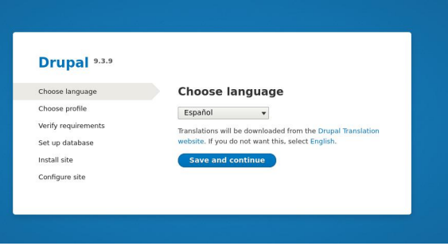
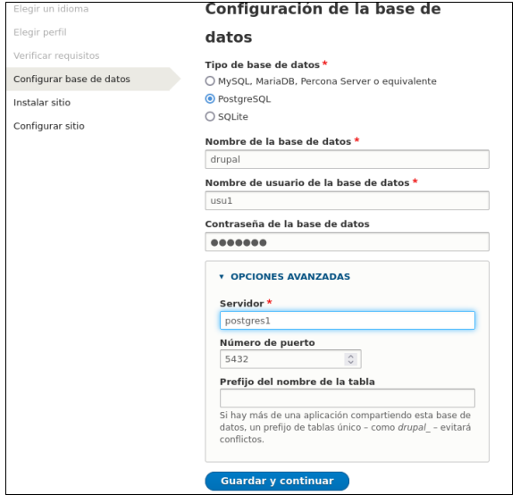
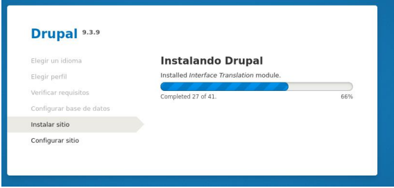
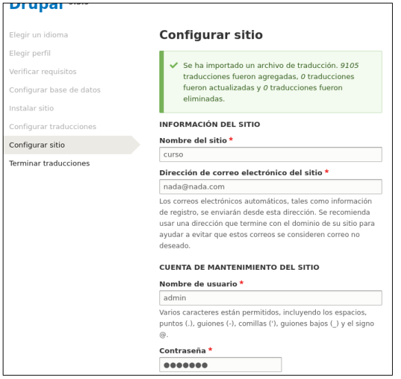
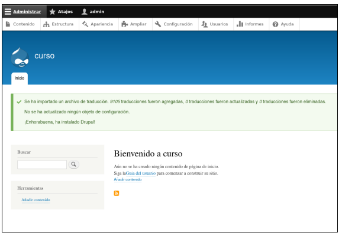

# Prácticas Docker

## 13. Enlazar contenedores

- Vamos a montar un enlace entre un Drupal (un gestor de contenidos open-source de los más usados y una Base de datos PosrtgreSQL:


- Comprobamos las redes que tenemos en este momento y que vienen de la práctica anterior:

```
docker network ls

NETWORK ID NAME DRIVER SCOPE
3d8689b8a3ea bridge bridge local
81ce05a3ba16 host host local
8e83268b846d net1 bridge local
31ed5d426215 net2 bridge local
17052d6bd175 none null local
```

-En este caso vamos a usar la red net1.Descargamos el contenedor de drupal:

```
docker pull drupal

Digest:
sha256:afec4ec454efc0079c00eb3e7ab99972567c15d9577f72377333eeca7e0ac625
Status: Downloaded newer image for drupal:latest

```

- Descargamos ahora la de PostgreSQL:

```
docker pull postgres
```

- Vamos en primer lugar a arrancar el contenedor Postgresql y crear la
  Base de datos. Le tenemos que indicar un nombre y luego una variable de entorno para la password, en este caso he puesto “secret”:

```
docker run -d --name postgres1 -e POSTGRES_PASSWORD=secret -e POSTGRES_USER=usu1 -e POSTGRES_DB=drupal --network net1 postgres

08fbb21e7e5cda6a2143f8bc675d63b4435f391a724f19e4f143fae42b3236fd

```

- Debemos tenerlo arrancado.. Podemos ver que la BBDD escucha por el
  puerto 5432:

```
docker ps

CONTAINER ID IMAGE COMMAND CREATED
STATUS PORTS NAMES
d1cfd3393a64 postgres "docker-entrypoint.s…" 21 seconds
ago Up 19 seconds 5432/tcp postgres1
```

- Podemos acceder con una bash para ver que tenemos funcionando la
  base de datos:

```
docker exec -it postgres1 bash
```

- Nos conectamos a la base de datos (la password es la que hemos
  puesto al crear el contenedor, “secret” en mi caso). Usamos el comando
  “psql”. Si todo es correcto tenemos base de datos:

```
psql -U postgres -W

Password:
psql (14.2 (Debian 14.2-1.pgdg110+1))
Type "help" for help.
postgres=#
```

- Podemos comprobar si está la base de datos “drupal” que hemos creado:

```
postgres=# \l

 List of databases
 Name | Owner | Encoding | Collate | Ctype | Access
privileges
-----------+----------+----------+------------+------------+------------------
-----
drupal | postgres | UTF8 | en_US.utf8 | en_US.utf8 |
postgres | postgres | UTF8 | en_US.utf8 | en_US.utf8 |
template0 | postgres | UTF8 | en_US.utf8 | en_US.utf8 | =c/postgres
+
 | | | | |
postgres=CTc/postgres
template1 | postgres | UTF8 | en_US.utf8 | en_US.utf8 | =c/postgres
+
 | | | | |
postgres=CTc/postgres
```

- Para salir de psql ponemos \q. Ahora arrancamos el contenedor de Drupal en la misma red.Le indicamos que para acceder al Drupal vamos a usar el puerto 8080 en la máquina host. No es necesario poner ningún dato de la Base de datos porque lo haremos en la instalación ```

```
docker run -d --name drupal1 --network net1 -p 8080:80 drupal

198d05df79d65bf6f6c4e943a24bc1f0281ee5e5745536ab8b680a03b8aa2872
```

- Podemos ver que están en marcha:

```
docker ps

CONTAINER ID IMAGE COMMAND CREATED
STATUS PORTS NAMES
6316aade2fe5 drupal "docker-php-entrypoi…" 5 seconds ago
Up 3 seconds 0.0.0.0:8080->80/tcp, :::8080->80/tcp drupal1
d1cfd3393a64 postgres "docker-entrypoint.s…" 10 minutes
ago Up 10 minutes 5432/tcp
postgres1

```

- Si ahora accedemos con el Navegador al puerto 8080, debe aparecer el
  proceso de instalación de Drupal:
  

  

- Si pasamos hasta la parte de “Configurar Base de datos” debemos poner
  los datos que indicamos en el contenedor de Postgres, entre ellos el nombre de la máquina, que es el del contenedro:
  
- Si todo ha ido bien, se terminará la instalación:
  

  

  
