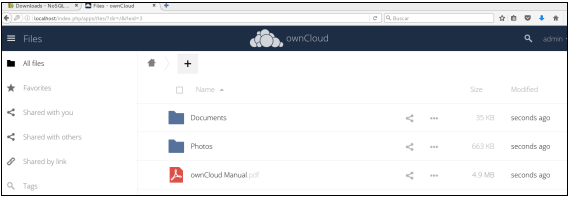
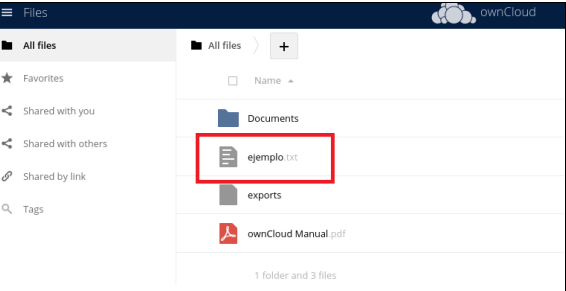

# Prácticas Docker

## 14. Volumenes que ya vienen con el contenedor. OwnCloud

- Vamos a lanzar un contenedor y vamos a ver como se crea un volumen de forma automática y para ver donde lo deja.En este caso vamos a usar una imagen de OwnCloud, que nos permite disponer de nuestro almacenamiento privado en la nube:


- Por defecto, usa el volumen situado en /var/www/html del contenedor.Primero nos descargamos la imagen:

```
docker pull owncloud/server
```

- Ahora vamos a ver los volúmenes que tenemos. Para este ejemplo, es
  posible que tengamos múltiples volúmenes ya creados de las prácticas
  que hemos ido haciendo a lo largo del curso, ya que muchos contenedores crean sus propios volúmenes.Ejecutamos el comando siguiente. En mi caso no tengo ningún volumen:

```
docker volume ls

DRIVER VOLUME NAME
```

- Es posible que a ti te salga bastantes más. Si quieres empezar desde
  cero puedes ejecutar estos dos comandos. NOTA: se borran todos los contenedores y volúmenes que tienes. El primero borra los contenedores y el segundo los volúmenes que están sin usar:

```
docker rm `docker ps -qa`

docker volume prune
```

- Primero nos situamos en /var/lib/docker/volumes:

```
cd /var/lib/docker/volumes/

ls -l
total 44
-rw-------. 1 root root 65536 mar 24 17:17 metadata.db

```

- Si has dejado algún volumen, a ti te saldrán mas directorios.Para probar que funciona correctamente, vamos a crear un contenedor que se elimine al salir:

```
docker run -d --rm -p 80 8080 --name cloud1 owncloud/server
09108071010a45ae3a3335167468a4498d90f7b9564190e3a44f6560dc63fc94
```

- Podemos comprobar que tenemos un nuevo directorio, asociado al volumen del contenedor:

```
ls -ltr

total 32
drwx-----x. 3 root root 19 abr 13 10:30
f5188d78922cd65dbd845d9365985df863ecbdbef13c34019171f23ec5608048
-rw-------. 1 root root 65536 abr 13 10:24 metadata.db
```

- Y dentro tenemos un directorio denominado “\_data” donde podemos ver
  lo que el contenedor persiste

```
# cd

f5188d78922cd65dbd845d9365985df863ecbdbef13c34019171f23ec5608048/_data
ls -l

total 0
drwxr-xr-x. 2 33 root 6 abr 13 10:24 apps
drwxr-xr-x. 2 33 root 82 abr 13 10:25 config
drwxrwx---. 4 33 root 132 abr 13 10:27 files
drwxr-xr-x. 2 33 root 6 abr 13 10:24 sessions
```

- Si entramos en la máquina principal por el puerto 80:

  

- Nos pide crear una cuenta de administración. Ponemos “admin” tanto
  para el usuario como para la password. Al entrar aparece la siguiente
  pantalla.
  

- Por tanto, si usamos este contenedor, los ficheros que subamos se
  almacenan en un volumen persistente y perviven a través de apagados y
  cierres de contenedores.Desde dentro del directorio \_data nos situamos en el directorio “files/admin/files”. Vemos que está el contenido de los ficheros que salen en la página web:

```
cd files/admin/files

ls -l
total 6516
drwxr-xr-x. 2 33 tape 25 abr 13 10:36 Documents
-rw-r--r--. 1 33 tape 6668668 abr 13 10:36 'ownCloud
Manual.pdf'
drwxr-xr-x. 2 33 tape 75 abr 13 10:36 Photos

```

- Si subimos algo a través del navegado para probar, debe dejarlo en este
  directorio.Yo he subido un pequeño fichero de texto:



- Debe haberlo dejado dentro del directorio:

```
ls -l

total 6516
drwxr-xr-x. 2 33 tape 25 abr 13 10:36 Documents
-rw-r--r--. 1 33 tape 0 abr 13 10:40 ejemplo.txt
-rw-r--r--. 1 33 tape 0 sep 10 2018 exports
-rw-r--r--. 1 33 tape 6668668 abr 13 10:36 'ownCloud Manual.pdf'

```

- Podemos ver que todo lo que hacer el contenedor lo deja en ese volumen.Ahora vamos a inspeccionar la información del volumen y del contenedor.Podemos ver el nombre del volumen:

```

docker volume ls

DRIVER VOLUME NAME
local
f5188d78922cd65dbd845d9365985df863ecbdbef13c34019171f23ec5608048


```

- Podemos hacer un inspect del volumen. Dado que genera bastante información la mandamos a un fichero:

```
docker volume inspect

f5188d78922cd65dbd845d9365985df863ecbdbef13c34019171f23ec5608048 > v1.txt
```

- Editamos el fichero para ver su contenido. Podemos ver toda su infomación:

```
[
 {
 "CreatedAt": "2022-04-13T10:30:02+02:00",
 "Driver": "local",
 "Labels": null,
 "Mountpoint":
"/var/lib/docker/volumes/f5188d78922cd65dbd845d9365985df86
3ecbdbef13c34019171f23ec5608048/_data",
 "Name":
"f5188d78922cd65dbd845d9365985df863ecbdbef13c34019171f23ec
5608048",
 "Options": null,
 "Scope": "local"
 }
]

```

- Ahora hacemos lo mismo con el contenedor:

```
docker inspect cloud1 > cloud1.json
```

- Editamos su contenido y buscamos la zona donde están los volúmenes.
  Podemos observar que el volumen está asociado al directorio “/mnt/data”:

```
"Mounts": [
 {
 "Type": "volume",
 "Name":
"f5188d78922cd65dbd845d9365985df863ecbdbef13c34019171f23ec
5608048",
 "Source":
"/var/lib/docker/volumes/f5188d78922cd65dbd845d9365985df86
3ecbdbef13c34019171f23ec5608048/_data",
 "Destination": "/mnt/data",
 "Driver": "local",
 "Mode": "",
 "RW": true,
 "Propagation": ""
 }
 ],,

```

- Paramos el contenedor. Dado que lo hemos creado con la opción “--rm”
  también borra el volumen:

```
docker stop cloud1

cloud1
docker volume ls
DRIVER VOLUME NAME

```

## 14.1. Crear un volumen en el contenedor

- Ahora vamos a hacer un ejemplo de crear un volumen en un contenedor. Nos vamos a /var/docker/lib/volumes.Comprobamos los directorios que hay, si tenemos alguno.Lanzamos un contenedor y le asociamos un volumen, por ejemplo con Fedora. El directorio del contenedor es /datos:

```
docker run -it --name fedora1 -v /datos fedora bash

[root@61e44cd000f1 /]#
```

- Nos habrá creado un directorio y un volumen

```
ls -l

total 44
drwxr-xr-x. 3 root root 19 mar 24 17:57
44787bbc29f93859ab2b6830b1ae39f678c0b13fdadf1f6e2db4a6314fbec92b
-rw-------. 1 root root 65536 mar 24 17:57 metadata.db+
docker volume ls
DRIVER VOLUME NAME
local
44787bbc29f93859ab2b6830b1ae39f678c0b13fdadf1f6e2db4a6314fbec92b
```

- Nos vamos al contenedor y creamos un fichero en el directorio /datos:

```
[root@61e44cd000f1 /]# cd datos

[root@61e44cd000f1 datos]# touch f1.txt
```

- Si nos vamos al directorio \_data del volumen debe aparecer:

```
#cd
44787bbc29f93859ab2b6830b1ae39f678c0b13fdadf1f6e2db4a6314f
bec92b/_data/
# ls
f1.txt
```

- Si ahora creamos un fichero en ese directorio debe aparecer en /datos
  del contenedor.Si ahora creamos un fichero en ese directorio debe aparecer en /datos del contenedor.Por último salimos del contenedor.Si comprobamos los volúmenes, debe seguir existiendo, ya que n o se borra cuando el contenedor se par.Por último salimos del contenedor.Si comprobamos los volúmenes, debe seguir existiendo, ya que n o se borra cuando el contenedor se para:

```
docker volume ls
DRIVER VOLUME NAME
local
44787bbc29f93859ab2b6830b1ae39f678c0b13fdadf1f6e2db4a6314fbec92b
```
