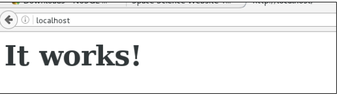
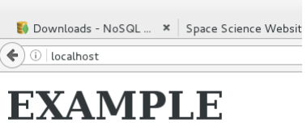

# Prácticas Docker

## 15. Crear volúmenes

- Vamos a crear un volumen:

```
docker volume create v1

v1
```

- Podemos ver el volumen creado:

```
docker volume ls

DRIVER VOLUME NAME
local
44787bbc29f93859ab2b6830b1ae39f678c0b13fdadf1f6e2db4a6314f
bec92b
local v1

```

- Si nos vamos a /var/lib/docker/volumes debemos tener ese directorio:

```
ls -l

total 44
drwxr-xr-x. 3 root root 19 mar 24 17:57
44787bbc29f93859ab2b6830b1ae39f678c0b13fdadf1f6e2db4a6314f
bec92b
-rw-------. 1 root root 65536 mar 25 00:38 metadata.db
drwxr-xr-x. 3 root root 19 mar 25 00:38 v1
```

- Vamos a crear un contenedor Apache que use ese volumen:

```
docker run -d --name apache1 -p 80:80 -v v1:/usr/local/apache2/htdocs/ httpd
797728fcff91bc7e0d911fd2c40a123671c9c6f522d73886cc40af321cab72b9

```

- Desde un navegador comprobamos la página Web:



- Nos vamos al directorio v1/\_data del volumen y editamos el fichero
  index.html con algún contenido:

  - Recargamos la página
    

- Paramos el contenedor:

```
docker stop apache1

```

- Intentamos borramos el volumen. No nos debe dejar debido a que hay
  un contenedor asociado:

```
docker volume rm v1

Error response from daemon: unable to remove volume:
remove v1: volume is in use -
[797728fcff91bc7e0d911fd2c40a123671c9c6f522d73886cc40af321
cab72b9]

```

- Borramos el contenedor:

```
docker rm apache1

apache1

```

- Ahora si podemos borrar el volumen:

```
docker volume rm v1

v1

```
