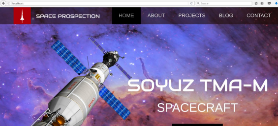
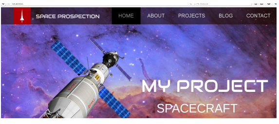

# Prácticas Docker

## 16. Bind Mounts. Crear un directorio compartido entre la máquina principal y el host

- Vamos a ver como podemos compartir un directorio entre la máquina principal y un contenedor.En este caso vamos a usar una imagen de APACHE HTTPD, donde
  desplegaremos una aplicación WEB sencilla que modificaremos desde el host principal:


- Nos descargamos la imagen de HTTP:

```
docker pull httpd

Using default tag: latest
latest: Pulling from library/httpd
f2b6b4884fc8: Already exists
b58fe2a5c9f1: Pull complete
e797fea70c45: Pull complete
6c7b4723e810: Pull complete
02074013c987: Pull complete
4ad329af1f9e: Pull complete
0cc56b739fe0: Pull complete
Digest:
sha256:cf82f4031e4e9f20c50ebf155ba281e302f3ae07ae292b16b9b
cf9a689c80b99
Status: Downloaded newer image for httpd:latest
```

- Ahora, descárgate de los recursos de la práctica el fichero ejemplosoyuz.zip.
  - Creas un directorio denominado /app en el host principal.
  - Descomprime el fichero zip en ese directorio.
  - Vamos ahora a crear un contenedor de Apache que comparta el directorio /app del host con el /usr/local/apache2/htdocs/:

```
docker run -d --name apache1 -p 80:80 -v /app:/usr/local/apache2/htdocs/

httpd
b2fe45c6565521efdadc0eb401cf5fb1607e65064428ab4e70e5da258b509b4d
```

- Si abrimos un navegador por el puerto 80 debe aparece la aplicación
  web que hemos compartido con el contenedor:



- Ahora vamos a modificar la página WEB desde el host para comprobar
  como está integrada con el contenedor. - Abrimos el fichero /app/index.html - Cambiamos el texto “SOYUZ TMA-M” , por alguno nuestro - Recargamos la página.



- Vamos ahora a comprobar la información que tiene el contenedor:

  - Mandamos la información a un fichero, ya que sale mucho contenido
  - Abrimos el fichero y buscamos la sección de los volúmenes
  - Debe salir algo parecido a lo siguiente. Vemos que pone “bind”, al ser un enlace de un subdirectorio.

```
"Mounts": [
 {
 "Type": "bind",
 "Source": "/app",
 "Destination": "/usr/local/apache2/htdocs",
 "Mode": "",
 "RW": true,
 "Propagation": "rprivate"
 }

```

- Vamos ahora a compartir el directorio /app con otro contenedor apache.
  - Lo arrancamos por el puerto 8080

```
docker run -d --name apache2 -p 8080:80 --volumes-from apache1
httpd
7a22463ad333ddf92e86883a69edf16c1e67a75cfe012d6eada15c28f19378a6

```

- Si arrancamos un navegador por ese puerto comprobamos que sale
  también la misma página
