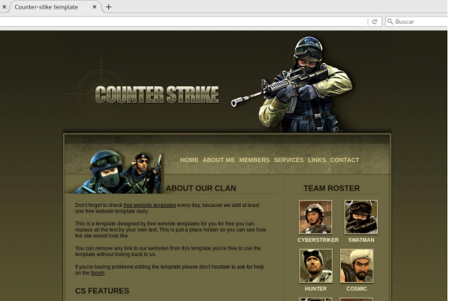

# Prácticas Docker

## 17. Prácticas con Dockerfile. Creación de un ejemplo con Nginx

- Vamos a crear un dockerfile basado en Nginx para repasar algunas de
  las opciones y parámetros usados en esta sección: - Creamos un directorio denominado imagen_nginx - Nos situamos dentro del mismo y creamos el fichero Dockerfile siguiente. Se explica en cada una de las líneas:

```
##Descargamos una versión concreta de UBUNTU, a través del tag
FROM ubuntu
##Actualizamos el sistema
RUN apt-get update
##Instalamos nginx
RUN apt-get install -y nginx
##Creamos un fichero index.html en el directorio por defecto de nginx
RUN echo 'Mi primer Dockerfile' > /var/www/html/index.html
##Arrancamos NGINX a través de ENTRYPOINT para que no pueda ser
##modificar en la creación del contenedor
ENTRYPOINT ["/usr/sbin/nginx", "-g", "daemon off;"]
##Exponemos el Puerto 80
EXPOSE 80
```

- Creamos la imagen. En este caso, y como la idea es subirlo luego a
  Docker Hub, vamos a llamarlo con el usuario que creamos en un capítulo anterior, en mi caso “danisoftcol”. Evidentemente vosotros tendréis que sustituirlo por el nuestro:

```
docker build -t danisoftcol/nginx:v1 .
```

- Ahora vamos a crer un contenedor desde el que poder acceder:

```
#docker run -d -p 80:80 --name nginx1 --rm danisoftcol/nginx:v1

b27f429e3368b088a613bb73fa9964f4df20460f3f27345b297b86b4ece11419

# docker ps

CONTAINER ID IMAGE COMMAND
CREATED STATUS PORTS NAMES
b27f429e3368 danisoftcol/nginx "/usr/sbin/nginx -g …" 2
seconds ago Up 1 second 0.0.0.0:80->80/tcp nginx1
```

- Desde un navegador, probamos que accedemos:


- Ahora vamos a crear una página web más sofisticada que tengamos en
  nuestro directorio y la añadimos a nuestro nginx - Descargamos el fichero “ejemplo_web.zip de los recursos del capítulo. - Creamos un directorio denominado “web” dentro del directorio del Dockerfile - Descomprimimos “ejemplo_web.zip” en la carpeta “web”. - Modificamos el Docker file. Sustituimos la línea.

```
RUN echo 'Mi primer Dockerfile' > /var/www/html/index.html

```

- Por la siguiente. Estamos pasando el contenido de esa carpeta la
  imagen:

```
ADD web /var/www/html/

```

- Creamos una nueva imagen con el tag v1:

```
docker build -t danisoftcol/nginx:v1 .

```

- Creamos otro nuevo contenedor. Debemos parar el anterior contenedor
  para poder usar el mismo puerto:

```
docker run -d -p 80:80 --name nginx2 --rm danisoftcol/nginx:v1
0fe567d73421bf0d8822d7b11966fa6198b1d66aebbf7fbd5f9fdfe98ebb920c

```

- Desde el navegador comprobamos que funciona correctamente:
  

- Ahora vamos a asignar un volumen que nos permite compartir el
  directorio “www” con el host principal. - Añadimos la siguiente línea:

```
VOLUME /var/www/html/

```

- El fichero dockerfile debe quedar de la siguiente manera:

```
FROM ubuntu
RUN apt-get update
RUN apt-get install -y nginx
##RUN echo 'Mi primer Dockerfile' > /var/www/html/index.html
VOLUME /var/www/html/
ADD web /var/www/html/
ENTRYPOINT ["/usr/sbin/nginx", "-g", "daemon off;"]
EXPOSE 80

```

- Creamos una nueva imagen:

```
docker build -t danisoftcol/nginx:v2 .
Sending build context to Docker daemon 57.14MB
Step 1/8 : FROM ubuntu:12.04
---> 5b117edd0b76
Step 2/8 : MAINTAINER Apasoft Formacion "apasoft.formacion@gmail.com"
---> Using cache
---> 74f806c64291
Step 3/8 : RUN apt-get update
---> Using cache
---> fcd41858c1ad
Step 4/8 : RUN apt-get install -y nginx
---> Using cache
---> 2a60f0ecd391
Step 5/8 : VOLUME /var/www/html/
---> Using cache
---> 1def2b36d9e6
Step 6/8 : ADD web/* /var/www/html/
---> Using cache
---> 214d68ac61cb
Step 7/8 : ENTRYPOINT ["/usr/sbin/nginx", "-g", "daemon off;"]
---> Using cache
---> 412c6801520b
Step 8/8 : EXPOSE 80
---> Using cache
---> 6524a5fe9680
Successfully built 6524a5fe9680
Successfully tagged danisoftcol/nginx:v2
```

- Antes de crear un contenedor, vamos a mirar los volúmenes que
  tenemos - En principio yo no tengo ninguno. Es bueno que de vez en cuando hagáis “docker volume prune” para borrar los que están sin utilizar

```
docker volume ls
DRIVER VOLUME NAME
```

- Creamos el contenedor. Debemos parar el anterior contenedor para
  poder usar el mismo puerto:

```
docker run -d -p 80:80 --name nginx2 --rm danisoftcol/nginx:v2
79d90e888707a77d16212245ef82f108d92d436a043d5a0ef5668f60ae4047b7

# docker ps
CONTAINER ID IMAGE COMMAND
CREATED STATUS PORTS NAMES
79d90e888707 danisoftcol/nginx:v2 "/usr/sbin/nginx -g …" 6
seconds ago Up 5 seconds 0.0.0.0:80->80/tcp nginx2
```

- Comprobamos desde el navegador que funciona correctamente - Si vemos de nuevo los volúmenes, podremos comprobar que ha creado
  uno

```
docker volume ls
DRIVER VOLUME NAME
local
55121602aaf83683df6c0f4c1f40ac9ce666c1262346e66aa401fa58f24151b4
```

- Si nos vamos al directorio \_data del volumen (en
  /var/lib/docker/volumes/nombre_volumen/\_data) deberíamos tener las
  páginas
- Podemos entrar por ejemplo en el fichero index.html y cambiarle algo del contenido.
- Recargamos la página y debería reflejarse en el navegador.
- Vamos ahora a crear un ARG para pasarle un argumento a la hora de crear la imagen. Vamos a decirle qué página web desplegar. Vamos a
  tener una en el directorio “web” y otra distintas en el directorio “web1”.
  Dependiendo de lo que pasemos en la variable ARG, la imagen llevará
  una u otra. - Creamos un directorio denominado web1 - Descargamos y descomprimimos el fichero “counterstrike2.zip” en ese directorio.
- Modificamos el fichero Dockerfile para añadir la variable y modificar el ADD:

```
FROM ubuntu
RUN apt-get update
RUN apt-get install -y nginx
##RUN echo 'Mi primer Dockerfile' > /var/www/html/index.html
VOLUME /var/www/html/
ARG webpage
ADD $webpage /var/www/html/
ENTRYPOINT ["/usr/sbin/nginx", "-g", "daemon off;"]
EXPOSE 80

```

- Al crear la imagen le indicamos la web a desplegar. En este caso web1,
  para que se lleve ese directorio. Le ponemos la etiqueta v3:

```
docker build -t danisoftcol/nginx:v3 --build-arg webpage=web1 .
```

- Creamos un contenedor:

```
docker run -d -p 80:80 --name nginx2 --rm danisoftcol/nginx:v3
```

- Comprobar desde el navegador que ha pasado la web correcta:

  

- Recrear la imagen pasando esta vez como argumento “webpage=web”
  para comprobar que pasa la primera correctamente
