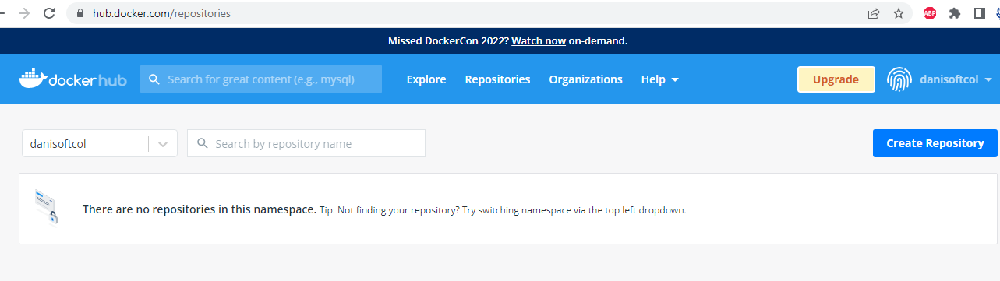
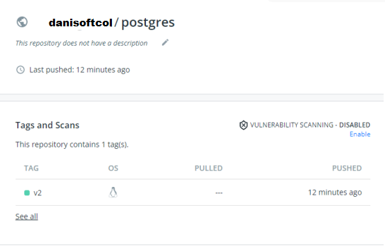

# Prácticas Docker

## 19. Prácticas con Dockerfile. Subir imágenes al Docker Hub

- Desde un navegador nos conectamos a Docker Hub con nuestras credenciales:
  

- Vamos a subir las dos últimas imágenes que hemos creado, la de Nginx
  y la de PostgreSQL, con el nombre correcto:
- En mi caso:
  - danisoftcol/nginx:v3
  - danisoftcol/postgres:v2
- Abrimos un terminal
- Nos logamos en Docker Hub desde el terminal, en mi caso con el usuario “danisoftcol”. Nosotros con el que creaste.

```
# docker login
Login with your Docker ID to push and pull images from
Docker Hub. If you don't have a Docker ID, head over to
https://hub.docker.com to create one.
Username (danisoftcol):
Password:
Login Succeeded
```

- Hacemos un push de las imágenes, primero con nginx:

```
docker push danisoftcol/nginx:v3
The push refers to repository
[docker.io/danisoftcol/nginx]
a12ba00c8c6e: Pushed
7416a318cce8: Pushed
f940815e2c5b: Pushed
3efd1f7c01f6: Mounted from library/ubuntu
73b4683e66e8: Mounted from library/ubuntu
ee60293db08f: Mounted from library/ubuntu
9dc188d975fd: Mounted from library/ubuntu
58bcc73dcf40: Mounted from library/ubuntu
v3: digest:
sha256:9acd4c662824e122b68ebdc4acc7a0bc2f80dadc9b9399ed1f2
2f7721eaff8f5 size: 1993
```

- Luego con el de PostgreSQL:

```
docker push danisoftcol/postgres:v2
The push refers to repository
[docker.io/danisoftcol/postgres]
2a9a07cfe975: Pushed
e31e6c671002: Pushed
848937af498c: Pushed
22b41371d67e: Pushed
f59db83a9f13: Pushed
edeceb95a907: Pushed
8404a3d96b18: Pushed
65262d4f5516: Mounted from library/ubuntu
dd420adea0d3: Mounted from library/ubuntu
3abb69fb15dc: Mounted from library/ubuntu
e95051d9cb9b: Mounted from library/ubuntu
92fb50b4d953: Mounted from library/ubuntu
v2: digest:
sha256:a728e56ba3584ba80769658f61e625a1842a85532416764cc58
83065840ee706 size: 3024
```

- Desde el navegador podemos comprobar que lo tenemos subido:
  

- Si entramos dentro del de PostgreSQL por ejemplo, podemos ver los
  Tags
  

- Como último ejemplo, vamos a subir una versión anterior, la v1. Vemos
  que algunas capas ya existen, de la versión anterior:

```
docker push danisoftcol/postgres:v1
The push refers to repository
[docker.io/danisoftcol/postgres]
c71fd618fee6: Pushed
ad9db8967689: Pushed
b72242b72bba: Pushed
6d2dc9dd1d08: Pushed
f59db83a9f13: Layer already exists
edeceb95a907: Layer already exists
8404a3d96b18: Layer already exists
65262d4f5516: Layer already exists
dd420adea0d3: Layer already exists
3abb69fb15dc: Layer already exists
e95051d9cb9b: Layer already exists
92fb50b4d953: Layer already exists
v1: digest:
sha256:4c418c36812ae77eabf52429ec31211e9836af7245bce8562d3
48b2338cba13b size: 2821
```

- Comprobamos en el navegador:


```

```

```

```
